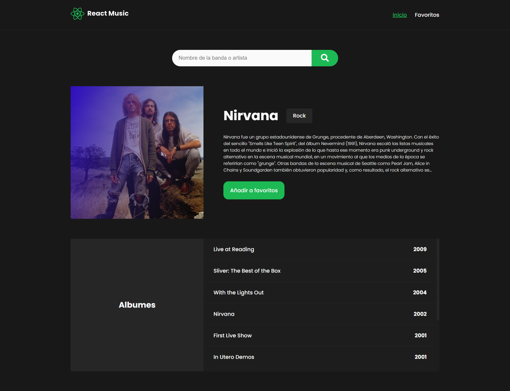

# 🤖React Music (Prueba de conocimiento de Cura Deuda)

Una aplicación que permite buscar información sobre diversas bandas y artistas musicales y agregarlos a favoritos usando la API de [AudioDB](https://www.theaudiodb.com/api_guide.php)

## 🖼️ Capturas de pantalla



## 🚀 ¿Como usar?

Clona e inicia el repositorio, para esta debes hacer lo siguiente:

### Primero debes de clonar el repositorio desde GitHub con el siguiente comando:

```shell
git clone https://github.com/JoseLuria/react-music.git
```

### Después con el siguiente comando instala las dependencias:

```shell
npm install
```

### Por último inicia el repositorio con el siguiente comando:

```shell
npm run dev
```

## ⚙️️Esta aplicación fue construida usando las siguientes tecnologías

- [React](https://reactjs.org/)
- [Sass](https://sass-lang.com/)
- [Vite](https://vitejs.dev/)

## License

[MIT](https://opensource.org/licenses/MIT)
